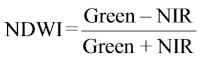

# Open Data Cube Workshop material

These materials will introduce working with Digital Earth Australia (DEA) data in the DEA Sandbox environment for the Open Data Cube (ODC). 
The tutorial is broken into the following sections:

1. Getting started: Accessing the Sandbox
2. Jupyter Notebooks: What are they and how to use them? 
3. Using interactive notebooks: Run a simple interactive notebook to perform a temporal analysis using DEA data
4. Do it yourself: Run and modify Python code to load, analyse and visualise data
5. Build it yourself: Explore the dea-notebooks code repository and build your own notebooks to answer specific analysis questions.
6. Learning more: How to continue exploring DEA data and resources   

At the end of the tutorial you will know how to use a Jupyter Notebook in conjunction with the ODC to access and analyse Earth observation data. 
The tutorial should take around two hours to complete.

---

## 1. Getting started

The DEA Sandbox is a learning and analysis environment for getting started with Digital Earth Australia and the Open Data Cube. 
It includes sample data and Jupyter notebooks that demonstrate the capability of the Open Data Cube.

#### Sign up for a DEA Sandbox Account

The DEA Sandbox uses requires you to create an account to log in. 
Please visit [https://app.sandbox.dea.ga.gov.au/](https://app.sandbox.dea.ga.gov.au/) to sign up for a new account (a verification code will be sent to the email address you register with), or log in if you already have one. 

#### Accessing the DEA Sandbox

After signing into the DEA Sandbox, your Jupyter environment will be created and you should see a loading screen while the system is working to prepare the environment.

Once signed in, the JupyterLab homepage should appear. 
The JupyterLab interface consists of the main work area (right-hand panel), the left sidebar (containing a file browser and other useful features), and a menu bar along the top:

## 2. Jupyter Notebooks

Jupyter is an interactive coding environment that allows you to create and share documents, as Jupyter Notebooks, that contain live code, equations, visualizations and narrative text. Uses include: data cleaning and transformation, numerical simulation, statistical modeling, data visualization, machine learning, and much more [jupyter.org](jupyter.org).

The name ‘Jupyter’ comes from Julia, Python and R, which are all programming languages that are used in scientific computing. Jupyter started as a purely Python-based environment called iPython, but there has been rapid progress over the last few years, and now many large organisations like [Netflix](https://netflixtechblog.com/notebook-innovation-591ee3221233) are using the system to analyse data.

As the ODC is a Python library, the workshop will cover working with Earth observation data in Python-based notebooks.

#### Getting started with Jupyter

The first exercise is to explore and understand some key features of the Jupyter notebook, including how to run cells containing code, and edit documentation. 
Click the link to run the following notebook:

[Introduction to Jupyter notebooks](../../Beginners_guide/01_Jupyter_notebooks.ipynb). 

Return here when you have worked through the examples in the notebook.

---

## 3. Using interactive notebooks

Click the link to run the following notebook:

[Measuring crop health](../../Real_world_examples/Crop_health.ipynb)

Return here when you have worked through the examples in the notebook.

---

## 4. Do it yourself

This activity uses a code-based Jupyter notebook to demonstrate how the ODC Python API works. 
This example includes the following analysis steps:

- Picking a study site in Australia
- Loading satellite data for that area
- Plotting red, green and blue satellite bands as a true colour image
- Using a vegetation index to calculate the "greenness" of an image
- Exporting your data to a raster file

Click the link to run the following notebook:

[Performing a basic analysis](../06_Basic_analysis.ipynb)

#### Next steps
Once you have run the notebook in its entirety, return to the top and experiment with changing some of the variables. 
For example, consider setting a new study location, and/or changing the time period of the analysis.

---

## 5. Build it yourself

For the next exercise, we will build a new analysis focused around a specific scientific question: 

*Monitor how waterbodies in Australia have changed over time using satellite data.*

Choose one of the following options depending on difficulty: 

#### Intermediate level: Update the basic analysis notebook to study changes in water over time

Starting at the top of the [Performing a basic analysis](../06_Basic_analysis.ipynb) notebook, modify the notebook to change the analysis to focus on monitoring changes in water over time. 
This could involve:

- Changing the study area to a location with a waterbody (e.g. Canberra's Lake Tuggeranong, or Lake Menindee in western New South Wales)
- Change the  Normalised Difference Vegetation Index (NDVI) used in the notebook to a new index that is better for monitoring water. 
For example, the Normalised Difference Water Index (NDWI) that is used to monitor changes related to water content in water bodies:

- Plot the output water index results for different timesteps to compare how distributions of water have changed over time.

#### Advanced level: Build a new analysis from scratch

Starting from a blank notebook ([hint](../01_Jupyter_notebooks.ipynb)), build a new analysis from scratch using content from the [Performing a basic analysis](../06_Basic_analysis.ipynb) notebook, and code from other notebooks in the [Digital Earth Australia Notebooks repository](https://github.com/GeoscienceAustralia/dea-notebooks/). For example, this could involve:

- Using the `load_ard` function to load cloud-free Landsat or Sentinel-2 imagery (see the [Using load_ard](../../Frequently_used_code/Using_load_ard.ipynb) notebook)
- Calculating a water index (e.g. Normalised Difference Water Index or NDWI) using the `calculate_indices` function (see the [Calculating_band_indices](../../Frequently_used_code/Calculating_band_indices.ipynb) notebook)
- Plot the output water index results for different timesteps to compare how distributions of water have changed over time.

#### *Hints*

- Model your answers on the workflow introduced in section 4,
  [Do it yourself](../06_Basic_analysis.ipynb).
- Explore other notebooks in the dea-notebooks repository, particularly those in
  the 'Real_world_examples' folder, e.g.
  - [Burnt_area_mapping](../../Real_world_examples/Burnt_area_mapping.ipynb)
  - [Change_detection](../../Real_world_examples/Change_detection.ipynb)
  - [Coastal_erosion](../../Real_world_examples/Coastal_erosion.ipynb) *Advanced*
- You can view multiple notebooks simultaneously in Jupyter Lab. Simply click and
  drag your notebook tab to the right hand side of your screen for a side by side
  view.
- All the code in this repository is open source and we encourage code recycling
  to fit your needs. Therefore, you can copy/paste cells between notebooks by
  right-clicking inside a cell, selecting `Copy Cells` and then navigating to your
  desired paste-location and right click any cell then selecting 'Paste Cells
  Below'
  
---

## 6. Learning more

For a more detailed introduction to Digital Earth Australia and the Open Data Cube, we recommend running the entire set of Beginner's Guide notebooks located in this folder, starting with [Performing a basic analysis](../06_Basic_analysis.ipynb) and continuing on to [Parallel processing with Dask.ipynb](../09_Parallel_processing_with_Dask.ipynb).

You can now join more advanced users in exploring:

- The "DEA datasets" directory in the repository, where you can explore DEA products in depth.
- The "Frequently used code" directory, which contains a recipe book of common techniques and methods for analysing DEA data.
- The "Real-world examples" directory, which provides more complex workflows and analysis case studies focused on answering real-world scientific and management problems using the Open Data Cube.
