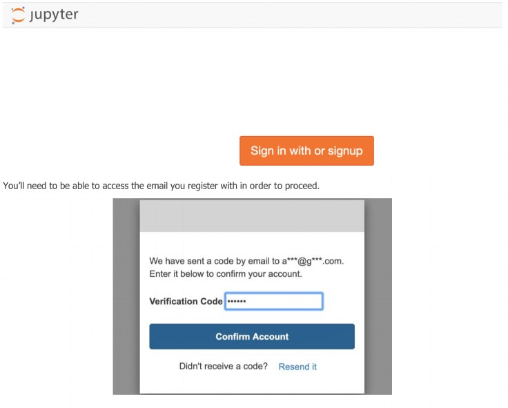
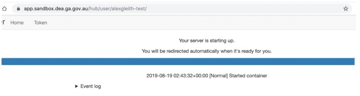
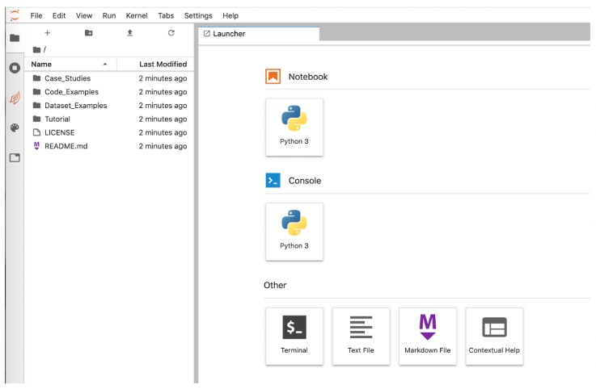

# Introduction

These materials will introduce working with Digital Earth Australia (DEA) data
in the DEA Sandbox environment for the Open Data Cube (ODC). The tutorial is
broken into the following sections:

1. Getting started - access the sandbox

- ODC (Alex's feeling is to leave this part out of the tutorial notes for now)
  - Open Data Cube
  - Digital Earth Australia
  - Analysis Ready Data

2. Learning Jupyter – explore what a Jupyter Notebook is
1. Using Apps – run some simple apps demonstrating case studies
1. Do it yourself – run and modify Python code to load, analyse and visualise data
1. Build it yourself - explore the dea-notebooks code repository and build your own
   notebooks to answer specific analysis questions.

At the end of the tutorial you will know how to use a Jupyter Notebook in
conjunction with the ODC to access and analyse Earth observation data. The
tutorial should take around two hours to complete.

# 1. Getting started

## Sign up for a DEA Sandbox Account

The DEA Sandbox uses requires you to create an account to log in. Please visit
[https://app.sandbox.dea.ga.gov.au/](https://app.sandbox.dea.ga.gov.au/) to sign
up for a new account, or log in if you already have one



## Accessing the DEA Sandbox

After signing intothe DEA Sandbox, your Jupyter environment will be created and
you should see a loading screen (also shown below) while the system is working
to prepare the environment.



Once signed in, the Jupyter Lab homepage should appear (see below). The folders
on the left may look different but the launcher tab should appear the same.



# What is ODC, DEA and ARD?

For more background on Open Data Cube, Digital Earth Australia and DEA Analysis
Ready Data, see: [Digital Earth Australia](../02_DEA.ipynb)

# 2. Learning Jupyter

## Overview

Jupyter is an interactive coding environment. The name ‘Jupyter’ comes from
Julia, Python and R, which are all programming languages that are used in
scientific computing. Jupyter started as a purely Python-based environment,
called iPython, but there has been rapid progress over the last few years, and
now many large organisations like Netflix (*1*) are using the system to analyse
data.

## Since the ODC is a Python library, the workshop will cover working with Earth observation data in Python

based notebooks.

*1*
[https://medium.com/netflix-techblog/notebook-innovation-591ee3221233](https://medium.com/netflix-techblog/notebook-innovation-591ee3221233)

## Getting started with Jupyter

The first exercise is to explore and understand some key features of the Jupyter
notebook.

*If you’ve used Jupyter before, you may want to skip this step.*

### Running (executing) a cell

Jupyter Notebooks allow code to be separated into sections that can be executed
independent of one another. These sections are called cells.

Python code is written into individual cells that can be executed by placing the
cursor in the cell and typing `Shift-Enter` on the keyboard or selecting the ►
"Run the selected cells and advance" button in the ribbon at the top of the
notebook. These options will run a single cell at a time.

To automatically run all cells in a notebook, navigate to the "Run" tab of the
menu bar at the top of JupyterLab and select "Run All Cells" (or the option that
best suits your needs). When a cell is run, the cell's content is executed. Any
output produced from running the cell will appear directly below it.

Run the cell below:

```python
print("I ran a cell!")
```

```
I ran a cell!
```

### Cell status

The `[ ]:` symbol to the left of each Code cell describes the state of the cell:

- `[ ]:` means that the cell has not been run yet.
- `[*]:` means that the cell is currently running.
- `[1]:` means that the cell has finished running and was the first cell run.

The number indicates the order that the cells were run in.

> **Note:** To check whether a cell is currently executing in a Jupyter notebook,
> inspect the small circle in the top-right of the window. The circle will turn
> grey ("Kernel busy") when the cell is running, and return to empty ("Kernel
> idle") when the process is complete.

## Jupyter notebook cell types

Cells are identified as either Code, Markdown, or Raw. This designation can be
changed using the ribbon at the top of the notebook.

#### Code cells

All code operations are performed in Code cells. Code cells can be used to edit
and write new code, and perform tasks like loading data, plotting data and
running analyses.

#### Markdown cells

Markdown cells provide the narrative to a notebook. They are used for text and
are useful to describe the code operations in the following cells.

#### Raw cells

Information in Raw cells is stored in the notebook metadata and can be used to
render different code formats into HTML or 𝐿𝐴𝑇𝐸𝑋 . For the purposes of this
tutorial, raw cells are not used by the authors and are not required for most
notebook users.

#### For more on Jupyter notebooks

For more on Jupyter notebooks, including further definition of the cell types,
stopping and restarting your notebook or saving and exporting your work, see
[this notebook](../01_Jupyter_notebooks.ipynb) in the DEA Beginners Guide

# 3. Using apps

This example makes use of ‘macros’, which is where more complex code has been
wrapped up into simple expressions. In this document, these ‘macros’ are
referred to as ‘apps’. The ‘apps’ make it simple to change an analysis, as they
provide ways to interact with the analysis that don’t require changes to the
underlying code.

Click the link to run the following notebook
[Crop_health](../../Real_world_examples/Crop_health.ipynb)

Return to this notebook when you are done.

# 4. Do it yourself

This activity uses a code-based (rather than app-based) notebook, to demonstrate
how the ODC Python API works. This will be a simple example of:

- picking a study site in Australia
- loading data for that area
- plotting bands into the red, green and blue channels of an image
- using a vegetation indice to calculate greenness in the image
- exporting your data to geotiff

Click the link to run the following notebook
[Basic analysis](../06_Basic_analysis.ipynb)

Run the notebook in its entirety to begin with then return to the top and have a
go yourself at changing some of the variables. Consider setting a new study
location and/or changing the time period of the analysis.

After attempting the extension activities in the notebook, if you are keen to
continue experimenting then try and calculate a different index over a new study
area. For example, calculate the
[Normalised Difference Water Index](https://eos.com/ndwi/) over a terrestrial
and aquatic environment to detect water bodies or water stressed vegetation.

Return to this notebook when you are done.

# 5. Exercises

Now it's time to build it yourself.

Starting with a blank notebook ([hint](../01_Jupyter_notebooks.ipynb)), select
one of the following analysis questions to try and answer on your own:

- **How has urban development changed the layout/footprint of your hometown between 2014 and 2020?**
  - Copy/paste of the `Urban_change_detection.ipynb`. Practices dask, geomedians,
    plot rgb, index calculation (ENDISI)
- **How soon after the (non-lethal) bushfires in x location, y year, did remote sensing begin to detect a return of greenness to the local vegetation?**
  - Practices burnt area mapping, NDVI calculation, change detection/filmstrips
- **How did the annual median surface area/perimeter of the Menindee Lakes (lake Eyre?) change between the peak of the drought compared to 2020?**
  - Practices index and median calculation, index thresholding, subpixel contours
    (Frequently_used_code folder)
- **What is the annual median spatial distribution of bare, dry and vegetated ground cover for an area of your interest?**
  - Explore DEA products/measurements, Load a product (fractional cover)
  - **EXTENSION: Compare wet/dry season results for your area of interest**

#### *Hints*

- Model your answers on the workflow introduced in section 4,
  [Do it yourself](../06_Basic_analysis.ipynb).
- Explore other notebooks in the dea-notebooks repository, particularly those in
  the 'Real_world_examples' folder, e.g.
  - [Burnt_area_mapping](../../Real_world_examples/Burnt_area_mapping.ipynb)
  - [Change_detection](../../Real_world_examples/Change_detection.ipynb)
  - [Coastal_erosion](../../Real_world_examples/Coastal_erosion.ipynb) *Advanced*
- You can view multiple notebooks simultaneously in Jupyter Lab. Simply click and
  drag your notebook tab to the right hand side of your screen for a side by side
  view.
- All the code in this repository is open source and we encourage code recycling
  to fit your needs. Therefore, you can copy/paste cells between notebooks by
  right-clicking inside a cell, selecting `Copy Cells` and then navigating to your
  desired paste-location and right click any cell then selecting 'Paste Cells
  Below'

```python

```
