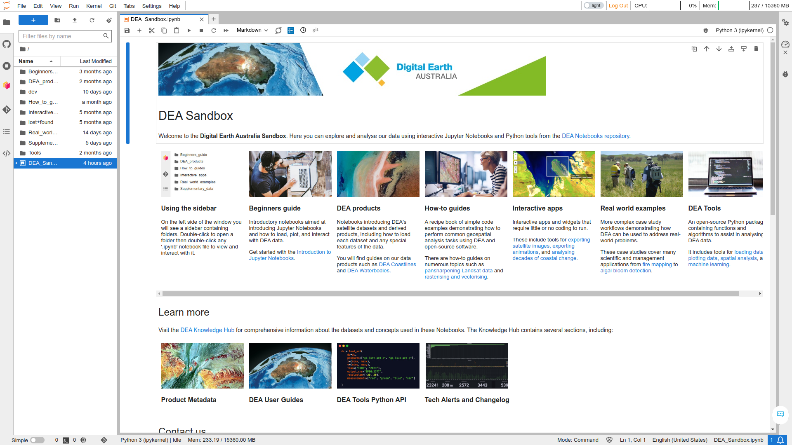

# DEA Notebooks

   

 

This is the DEA Notebooks and DEA Tools repository of [Digital Earth Australia](https://www.dea.ga.gov.au/).
These can be viewed on the [DEA Knowledge Hub](https://docs.dea.ga.gov.au/) and run on the
[DEA Sandbox](https://docs.dea.ga.gov.au/guides/setup/Sandbox/sandbox/) and the [National Computational Infrastructure (NCI)](https://docs.dea.ga.gov.au/guides/setup/NCI/README/).

**Contribute** &mdash; DEA Notebooks is open-source and we would love your contribution!
Learn [how to contribute](#contribute) below.

**License** &mdash; The code in this repository is licensed under the [Apache
License, Version 2.0](https://www.apache.org/licenses/LICENSE-2.0). DEA
data is licensed under the [Creative Commons by Attribution 4.0
license](https://creativecommons.org/licenses/by/4.0/).

**Documentation** &mdash; See the [DEA Notebooks
Wiki](https://github.com/GeoscienceAustralia/dea-notebooks/wiki).

**Contact** &mdash; For assistance with any of these notebooks and tools,
please ask a question on our [Open Data Cube Slack
channel](http://slack.opendatacube.org/) or on the [GIS Stack
Exchange](https://gis.stackexchange.com/questions/tagged/open-data-cube)
using the `open-data-cube` tag. You can also [report an issue on this
repository](https://github.com/GeoscienceAustralia/dea-notebooks/issues).

**Citation** &mdash; If you use this repository in your work, please reference
it with the following citation.

> Krause, C., Dunn, B., Bishop-Taylor, R., Adams, C., Burton, C., Alger,
> M., Chua, S., Phillips, C., Newey, V., Kouzoubov, K., Leith, A.,
> Ayers, D., Hicks, A., DEA Notebooks contributors 2021. Digital Earth
> Australia notebooks and tools repository. Geoscience Australia,
> Canberra. <https://doi.org/10.26186/145234>

## Introduction

The Jupyter Notebooks and Python tools in this repository are for
analysing DEA's satellite data products. The notebooks are designed to demonstrate
how to use the DEA data and tools to conduct a broad range of geospatial
analyses. They also demonstrate how to integrate with other open-source
software such as [Open Data Cube](https://www.opendatacube.org/) and
[xarray](http://xarray.pydata.org/en/stable/). You can see examples of
use cases on the [USAGE](https://github.com/GeoscienceAustralia/dea-notebooks/blob/stable/USAGE.rst)
page.

## Browse the DEA Knowledge Hub

The Knowledge Hub is where you can easily view the notebooks and read DEA Tools documentation. You can browse the following sections.

* **[Beginner’s guide](https://docs.dea.ga.gov.au/notebooks/Beginners_guide/)** &mdash;
  Introductory notebooks aimed at introducing Jupyter Notebooks and how to load,
  plot, and interact with DEA data.
* **[DEA products](https://docs.dea.ga.gov.au/notebooks/DEA_products/)** &mdash;
  Notebooks introducing DEA's satellite datasets and derived products,
  including how to load each dataset and any special features of the data.
* **[How-to guides](https://docs.dea.ga.gov.au/notebooks/How_to_guides/)** &mdash;
  A recipe book of simple code examples demonstrating how to perform common
  geospatial analysis tasks using DEA and open-source software.
* **[Interactive apps](https://docs.dea.ga.gov.au/notebooks/Interactive_apps/)** &mdash;
  Interactive apps and widgets that require little or no coding to run.
* **[Real-world examples](https://docs.dea.ga.gov.au/notebooks/Real_world_examples/)** &mdash;
  More complex case study workflows demonstrating how DEA can be
  used to address real-world problems.
* **[DEA Tools Package](https://docs.dea.ga.gov.au/notebooks/Tools/)** &mdash;
  An open-source Python package containing functions and
  algorithms to assist in analysing DEA data.

## Run on the DEA Sandbox

The **DEA Sandbox** is a free virtual environment for interacting with the notebooks and tools from your web browser. You can use the Sandbox to conduct geospatial analysis without installing anything on your computer. Learn how to [use the DEA Sandbox](https://docs.dea.ga.gov.au/guides/setup/Sandbox/sandbox/).

## Run on the NCI

The National Computational Infrastructure is a supercomputer environment available to Australian researchers, academics, and other users by negotiation. The NCI can be used for high-performance geospatial analysis. Learn how to [use the NCI](https://docs.dea.ga.gov.au/guides/setup/NCI/README/).

## How to contribute

To get started, see these articles in the wiki.

* [Git workflow](https://github.com/GeoscienceAustralia/dea-notebooks/wiki/Git-workflow)
* [Create a DEA Notebook](https://github.com/GeoscienceAustralia/dea-notebooks/wiki/Create-a-DEA-Notebook)
* [Edit a DEA Notebook](https://github.com/GeoscienceAustralia/dea-notebooks/wiki/Edit-a-DEA-Notebook)

We would also appreciate it if you could add your a citation to our
[USAGE](https://github.com/GeoscienceAustralia/dea-notebooks/blob/stable/USAGE.rst)
page.

All notebooks in this repository contain tags describing
their functionality.<!-- If you are searching for a specific functionality, use the [Tags Index](https://github.com/GeoscienceAustralia/dea-notebooks/blob/develop/genindex) to search for a suitable example. --> If there is an important functionality that has not been
documented, please [report an issue on this
repository](https://github.com/GeoscienceAustralia/dea-notebooks/issues).

